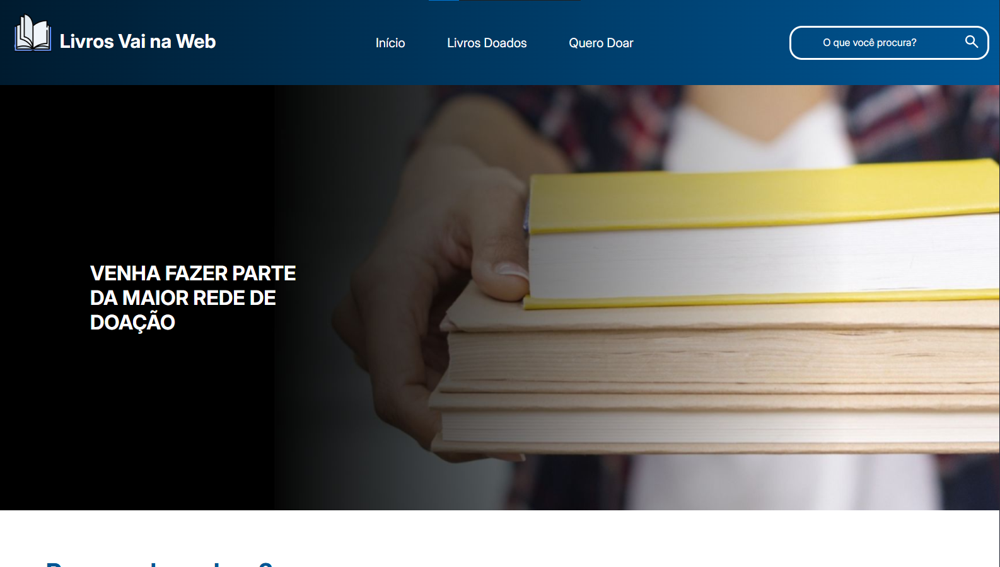

# Api Doação de Livros

Essa é uma API simples feita com Flask e SQLite3 para fins de estudo da escola Vai Na Web, ela permite cadastrar e listar dados.

## Como rodar o projeto

1. Faça o clone do repositório: 
```bash
git clone <URL_DO_REPOSITORIO>
cd nome-do-projeto
```

2. Crie um ambiente virtual (obrigatório):
```bash
python -m venv venv
source venv/Scripts/activate
```

3. Instale as dependências:
```bash
pip install -r requirements.txt
```

4. Inicie o servidor:
```bash
python app.py
```

> A api está disponível em http: http://127.0.0.1:5000/

## Endpoints

### POST /doar

Endpoint para cadastrar um novo livro.

**Formato de envio dos dados**
```json
{
    "titulo":"Herry Potter e a Ordem da Fênix",
    "categoria":"Fantasia",
    "autor":"J. K. Rowling",
    "image_url":"https://m.media-amazon.com/images/I/81d6ESyPZwL._AC_UF1000,1000_QL80_.jpg"
}
```

**Resposta 201 (Created)**:
```json
{
    "mensagem":"Livro cadastrado com sucesso"
}
```


### GET /livros

Retorna todos os livros cadastrados em nossa API.

**Resposta (200)**:
```json
{
    "id":"1",
    "titulo":"1001 formas de fugir de uma divida",
    "categoria":"calote",
    "autor":"desconhecido",
    "image_url":"https://..."
}
```

